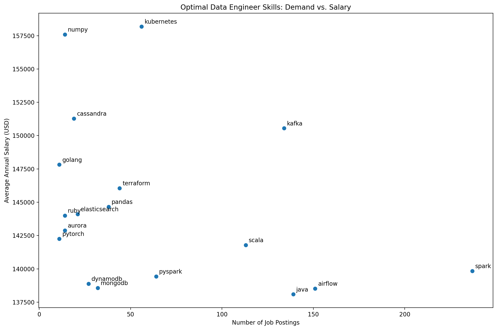

# Introduction
I have created this project to analyze the market of **Data Engineer Job Profile** to understand the skills, salaries, and job-market demand associated with the role.

The goal of this analysis is to answer five practical questions:

1. What are the top-paying Data Engineer jobs?
2. What skills are required for these top-paying jobs?
3. What skills are most in demand for Data Engineers?
4. Which skills are associated with higher salaries?
5. What are the most optimal skills to learn?

The analysis was performed using SQL on a job-postings dataset. I used SQL joins, filtering, aggregation, CTEs, `COUNT()`, `AVG()`, `GROUP BY`, `HAVING`, `ORDER BY`, `LIMIT`, and `STRING_AGG()` to explore the data.

SQL queries? check them out here: [project_sql](./SQL_Data_Analysis_Project/)
# Background
The questions I wanted to answer were:
1. What are the top paying data engineer jobs?
2. What skills are required for these top-paying jobs?
3. What skills are most in demand for data engineers?
4. Which skills are associated with higher salaries?
5. What are the most optimal skills to learn?
# Tools I Used
For my deep dive into the data engineer job market,
I harnessed the power of several key tools:
- **SQL**: The backbone of my analysis, allowing me to query the database and unearth critical insights.
- **PostgreSQL**: The chosen database management system, ideal for handling the job posting data.
- **Visual Studio Code**: My go-to for database management and executing SQL queries.
- **Git & GitHub**: Essential for version control and sharing my SQL scripts and analysis, ensuring collaboration and project tracking.
# The Analysis

1. What are the top-paying Data Engineer jobs?
The first analysis identifies the highest-paying Data Engineer positions.
The query:
- Filters the dataset for **Data Engineer** positions.
- Keeps jobs where salary information is available.
- Focuses on remote/anywhere jobs.
- Joins the job-postings table with the company table to obtain company names.
- Sorts jobs by annual salary in descending order.
- Returns the top 10 positions.

### SQL approach

```sql
SELECT
    job_id,
    job_title,
    job_location,
    salary_year_avg,
    job_posted_date,
    name AS company_name
FROM job_postings_fact
LEFT JOIN company_dim
    ON job_postings_fact.company_id = company_dim.company_id
WHERE job_title_short = 'Data Engineer'
  AND job_location = 'Anywhere'
  AND salary_year_avg IS NOT NULL
ORDER BY salary_year_avg DESC
LIMIT 10;
```
! [Top Paying Jobs](/assets/01_top_paying_data_engineer_jobs_sorted.png)
### Analysis

This gives an overview of the highest-paying Data Engineer opportunities in the dataset and helps identify companies and job titles associated with the highest salaries.

---

## 2. What skills are required for these top-paying jobs?

After identifying the top-paying Data Engineer jobs, I analyzed the skills associated with those positions.

I used a **CTE** to first identify the top 10 highest-paying jobs. I then joined those jobs with:

- `skills_job_dim`
- `skills_dim`

This allowed me to connect each job with the skills mentioned in the dataset.

I used `STRING_AGG()` to combine multiple skills into a single row for each job, making the results easier to read.

```sql
--I wanted to see the skills combined in a single row, so i wrote this query.
with top_paying_jobs as (
    select job_id,job_title,
    salary_year_avg,
    name as company_name from
    job_postings_fact 
    LEFT JOIN company_dim on 
    job_postings_fact.company_id=company_dim.company_id
    WHERE job_title_short='Data Engineer' AND
    job_location='Anywhere'
    and salary_year_avg is not NULL
    order by salary_year_avg desc
    LIMIT 10
    )
select top_paying_jobs.*,
string_agg(skills,chr(10) order by skills) as skills
 from top_paying_jobs
inner join skills_job_dim on top_paying_jobs.job_id=skills_job_dim.job_id
inner join skills_dim on skills_job_dim.skill_id=skills_dim.skill_id
group by top_paying_jobs.job_id,
top_paying_jobs.job_title,
top_paying_jobs.salary_year_avg,
top_paying_jobs.company_name
order by salary_year_avg desc;
```
### Why I used a CTE

The CTE separates the analysis into two logical steps:

1. Find the top-paying jobs.
2. Find the skills required for those jobs.

This makes the query easier to understand and maintain.

### Analysis

The important takeaway is that high-paying Data Engineering roles generally require a **combination of skills**, rather than one technology alone.

The skills appearing across these jobs can be grouped into areas such as:

- Programming
- Databases and SQL
- Cloud platforms
- Data processing
- Data warehousing
- Big data technologies
- Data engineering tools

This suggests that building a broad technical skill set is important when targeting higher-paying Data Engineering positions.

---

## 3. What skills are most in demand for Data Engineers?

The third analysis focuses on the number of Data Engineer job postings requiring each skill.

For this analysis, I focused on **Data Engineer jobs in India** and counted how many job postings were associated with each skill.

### SQL approach

```sql
SELECT
    skills,
    COUNT(skills_job_dim.job_id) AS total_jobs
FROM job_postings_fact
INNER JOIN skills_job_dim
    ON job_postings_fact.job_id = skills_job_dim.job_id
INNER JOIN skills_dim
    ON skills_job_dim.skill_id = skills_dim.skill_id
WHERE job_title_short = 'Data Engineer'
  AND job_location = 'Anywhere'
GROUP BY skills
ORDER BY total_jobs DESC
LIMIT 5;
```

### Analysis

This identifies the five skills appearing most frequently in Data Engineer job postings in India.

The purpose of this analysis is to understand what employers are asking for most often, rather than simply focusing on the highest-paying technologies.

---

## 4. Which skills are associated with higher salaries?

The fourth analysis looks at the relationship between individual skills and salary.

Instead of counting demand, I calculated the **average annual salary** of jobs associated with each skill.

The query:

- Filters for Data Engineer roles.
- Removes jobs without salary information.
- Groups jobs by skill.
- Calculates average salary.
- Sorts skills by average salary.
- Returns the top 25 skills by average salary.

### SQL approach

```sql
SELECT
    skills_dim.skills,
    ROUND(AVG(salary_year_avg), 0) AS avg_salary
FROM job_postings_fact
INNER JOIN skills_job_dim
    ON job_postings_fact.job_id = skills_job_dim.job_id
INNER JOIN skills_dim
    ON skills_job_dim.skill_id = skills_dim.skill_id
WHERE job_title_short = 'Data Engineer'
  AND salary_year_avg IS NOT NULL
  AND job_location = 'Anywhere'
GROUP BY skills_dim.skills
ORDER BY avg_salary DESC
LIMIT 25;
```

### Analysis

This analysis shows which skills are associated with higher average salaries.

However, a high average salary does **not necessarily mean that learning the skill alone will result in a high salary**. Some skills may appear mainly in senior or specialized roles, which can raise their average salary.

Therefore, salary should be considered together with demand.

---

## 5. What are the most optimal skills to learn?

The final analysis combines the two most important factors:

**Demand + Salary**

Instead of asking only:

> "Which skills are popular?"

or:

> "Which skills have the highest salary?"

I wanted to find skills that have a reasonable level of job demand while also being associated with higher salaries.

### Method

I calculated:

- `total_jobs` → number of job postings requiring each skill
- `avg_salary` → average salary associated with each skill

I then used:

```sql
HAVING COUNT(skills_job_dim.job_id) > 10
```

This removes skills that appear in only a small number of jobs.

Finally, the results are ordered by:

1. Average salary — highest first
2. Total jobs — highest first

```sql
SELECT 
    skills_dim.skill_id,
    skills_dim.skills,
    COUNT(skills_job_dim.job_id) AS total_jobs,
    ROUND(AVG(salary_year_avg),0) AS avg_salary
    FROM job_postings_fact
    INNER JOIN skills_job_dim
    ON job_postings_fact.job_id = skills_job_dim.job_id
    INNER JOIN skills_dim
    ON skills_job_dim.skill_id = skills_dim.skill_id
    WHERE job_title_short = 'Data Engineer'
    AND salary_year_avg IS NOT NULL
    AND job_work_from_home=True
    GROUP BY 
    skills_dim.skill_id,
    skills_dim.skills
    HAVING COUNT(skills_job_dim.job_id) > 10
    ORDER BY avg_salary DESC, total_jobs DESC
    LIMIT 20;
```

# What I Learned

Through this project, I learned how SQL can be used to answer real-world career and job-market questions rather than simply retrieving data.

### 1. Demand and salary are different measures

A skill can be highly demanded without being associated with the highest salaries.

Therefore, looking at only one metric can give an incomplete picture of the market.

### 2. High-paying jobs require multiple skills

The top-paying Data Engineer positions generally require combinations of programming, databases, cloud technologies, and data-processing tools.

This shows that becoming a Data Engineer is not about mastering one technology.

### 3. CTEs make complex analysis easier

I used CTEs to break the problem into smaller steps.

For example:

```text
Find high-demand skills
        ↓
Calculate average salary
        ↓
Combine the results
        ↓
Filter and rank skills
```

This made the logic easier to understand and allowed me to build a more structured analysis.

### 4. SQL joins are essential for real-world datasets

The analysis required combining information from multiple tables:

- Job postings
- Companies
- Skills
- Job-skill relationships

Understanding how these tables connect is essential when working with relational datasets.

### 5. I learned to think beyond basic SQL queries

Instead of only writing simple `SELECT` statements, this project helped me practice:

- Joins
- Aggregations
- CTEs
- Window of analysis
- Grouping
- Filtering aggregated results with `HAVING`
- Ranking results
- Combining multiple metrics

---

# Conclusion

## 1. What are the top-paying Data Engineer jobs?

### Insights

* The highest salaries in the dataset reach **$325,000 per year**, with two Data Engineer positions at Engtal.
* The top 3 positions have salaries of **$325K, $325K, and $300K**, showing significant earning potential in Data Engineering.
* Several senior-level roles such as **Staff Data Engineer, Principal Data Engineer, Director of Engineering, and Data Engineering Manager** appear in the top 10.
* The results suggest that **senior and specialized Data Engineering roles** tend to dominate the highest-paying positions.
* The presence of different companies and job titles among the top positions shows that high salaries are not limited to one specific company or title.

**Overall takeaway:**

> Data Engineering offers strong salary potential, particularly at senior, staff, principal, management, and specialized engineering levels.

---

## 2. What skills are required for these top-paying jobs?

### Key Insights

* **Python** is the most common skill, appearing in **7 out of the 10** top-paying jobs.
* **Spark** appears in **5 out of 10** jobs, highlighting the importance of distributed data processing in high-paying roles.
* **Hadoop, Kafka, and Scala** each appear in **3 jobs**.
* Other technologies such as **Databricks, Kubernetes, PySpark, Pandas, NumPy, and SQL** also appear among the top-paying positions.
* The skills cover several areas including **programming, big-data processing, cloud, orchestration, and data infrastructure**.

**Overall takeaway:**

> High-paying Data Engineer jobs generally require a **combination of skills**, with Python and Spark being particularly prominent rather than relying on one technology alone.

---

## 3. What skills are most in demand for Data Engineers?

### Key Insights

* **SQL** is the most demanded skill, appearing in **14,213 job postings**.
* **Python** is a very close second with **13,893 job postings**, only **320 fewer than SQL**.
* **AWS** is the third most demanded skill with **8,570 postings**, showing strong demand for cloud computing.
* **Azure** appears in **6,997 postings**, while **Spark** appears in **6,612**.
* SQL and Python are significantly more common than the other three skills, making them especially important foundational skills for Data Engineers.

**Overall takeaway:**

> **SQL and Python are the two strongest foundational skills**, while AWS, Azure, and Spark are important complementary skills for the Data Engineering job market.

---

## 4. Which skills are associated with higher salaries?

### Key Insights

* **Assembly** has the highest average salary at **$192,500**.
* It is followed by **Mongo ($182,223)** and **ggplot2 ($176,250)**.
* **Rust ($172,819)** and **Clojure ($170,867)** are also associated with relatively high salaries.
* Interestingly, some of the highest-paying skills are **specialized or niche technologies** rather than the most commonly demanded Data Engineering skills.
* For example, **Kubernetes has an average salary of $158,190**, while **Kafka has $150,549**.
* This demonstrates that **high salary and high demand are not necessarily the same thing**.

**Overall takeaway:**

> Some niche technologies are associated with very high salaries, but salary alone does not make a skill the best choice to learn because job availability also matters.

---

## 5. What are the most optimal skills to learn?

### Key Insights

* **Kubernetes** has the highest average salary among the filtered skills at **$158,190**, with 56 job postings.
* **Kafka** stands out as a particularly interesting skill because it combines a high average salary of **$150,549** with **134 job postings**.
* **Spark** has the highest demand among the skills shown, with **237 job postings**, while having an average salary of **$139,838**.
* **Airflow** also has strong demand with **151 postings** and an average salary of **$138,518**.
* **Java** has 139 postings and an average salary of **$138,087**, making it another relatively high-demand skill.
* Skills such as **NumPy and Cassandra** have high salaries but considerably fewer job postings, indicating a more specialized market.
* This shows the trade-off between **salary and demand**: a skill with the highest salary isn't necessarily the most practical skill to prioritize.

**Overall takeaway:**

> The most optimal skills should be evaluated based on **both demand and salary**. Skills such as **Kafka, Spark, Airflow, and Java** provide a stronger balance between market demand and salary than simply choosing the highest-paying niche skill.

---

### 🔥 Overall Project Insight

After combining all five analyses, the biggest conclusion is:
> **SQL and Python are essential foundational skills because of their extremely high demand, while technologies such as Spark, Kafka, Airflow, cloud platforms, and Kubernetes can help build a more specialized and potentially higher-paying Data Engineering skill set.**
This gives your project a much stronger story:
**High-paying jobs → Required skills → Market demand → Salary → Optimal skills**

That progression makes the analysis feel like an actual **career-oriented data analysis project**, rather than just five unrelated SQL queries.

This project provided a practical look at the Data Engineering job market by analyzing **salary, job demand, and required skills**.
The analysis shows that choosing skills based on only one factor can be misleading. The most useful approach is to consider both **how frequently employers request a skill and the salary associated with jobs requiring it**.

The analysis of top-paying jobs also shows that higher-paying Data Engineering roles tend to require a combination of technical skills rather than expertise in a single tool.

Overall, the project helped me understand how SQL can be used to turn a large job-postings dataset into actionable career insights.
